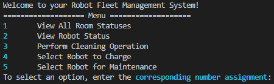

# Applications

The robot fleet management system will be a high level application.

Our fleet management app is a command line interface (CLI) that uses/communicates with only the `manage` library, which itself communicates with Room and Robot libraries.

When running our app, the user should see this (after successfully building the project):

