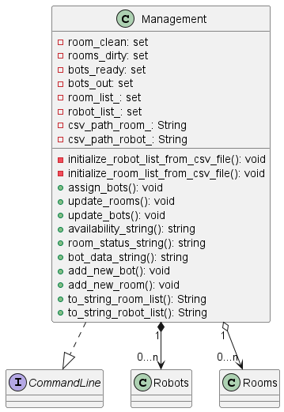
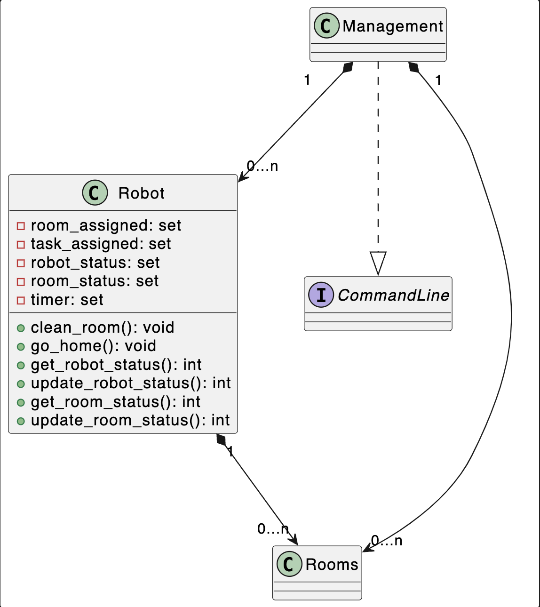
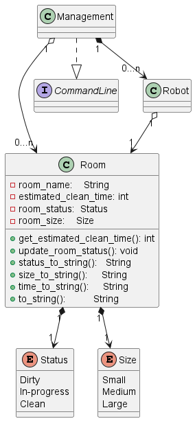
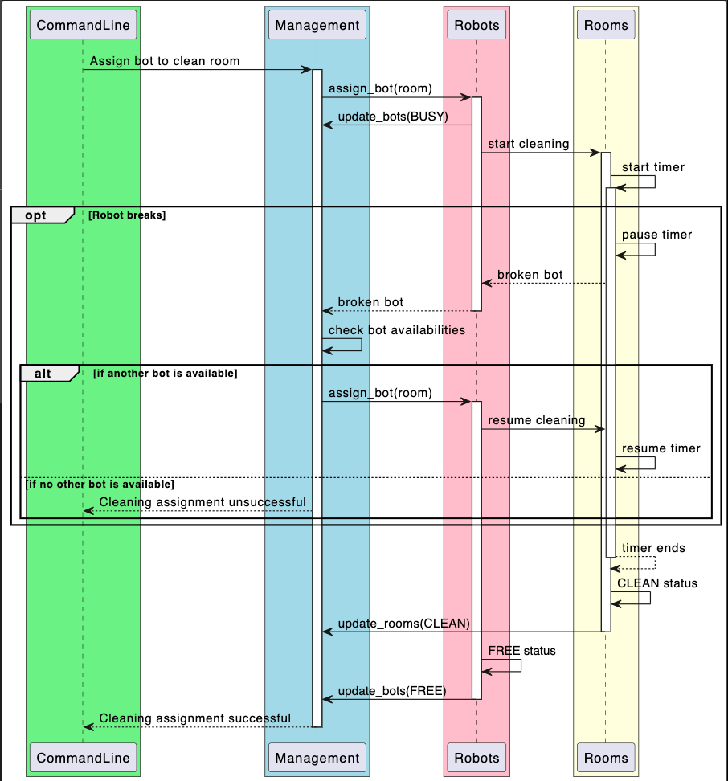
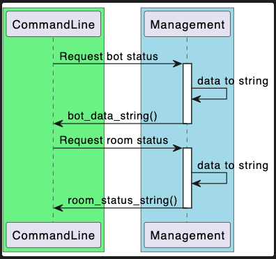
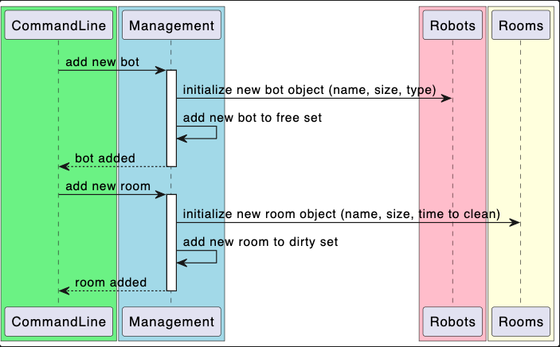
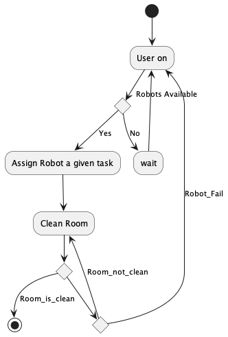

# Design Document for Robot Fleet Management Software
## Introduction
In our design document, we will be going over how we plan on developing our robot fleet management system.

_* Our actual design implementation isn't fully completed yet. We are still in the beginning phases of our Scrum development process._

## Project Overview

**Our software will help building managers, the customers, manage their fleet of cleaning robots in their building.**

Potential Design Ideas:

* Retrieval System of Robot Information from Backend Database
* Developers will potentially implement a bug detection system to ensure software has no external issues

# Class Diagram Documentation

## Management Class Diagram Overview

This document describes the class diagram for a simple management system that involves room cleaning by robots. The system focuses on the attributes of the main class, Management, and mentions its relationships with other classes and interfaces (CommandLine, Robots, Rooms). 

## Classes
### Management

Attributes

* room_clean: set: A set containing the rooms that are clean.
* rooms_dirty: set: A set containing the rooms that are dirty.
* bots_ready: set: A set containing the robots that are ready for cleaning.
* bots_out: set: A set containing the robots that are currently out cleaning or out of commission.

Methods

* assign_bots(): void: Assigns robots to rooms for cleaning.
* update_rooms(): void: Updates the status of rooms (clean/dirty).
* update_bots(): void: Updates the status of robots (clean/dirty).
* availability_string(): string: Returns a string representing the availability of robots (available/not).
* room_status_string(): string: Returns a string representing the status of rooms (clean/dirty).
* bot_data_string(): string: Returns a string representing the status of robots (size, type).
* add_new_bot(): void: Adds a new robot to the system.
* add_new_room(): void: Adds a new room to the system.

Relationships

* The Management class has a 1 to 0...n  composition relationship with the Rooms class.
* The Management class has a 1 to 0...n composition relationship with the Robots class.
* The Management class implements the CommandLine interface.

## Robot Class Diagram Overview

This document describes the class diagram for a system of robots that involves receiving input commands and cleaning rooms. The system focuses on the attributes of the Robot class and mentions its relationships with other classes and interfaces (Management, Rooms).

## Classes
### Robot

Attributes

* room_assigned: set: A set room assigned for robot to clean.
* task_assigned: set: A set task of either mop, scrub, or vacuum.
* robot_status: set: Status of robot ready or not.
* room_status: set: The status of the room currently assigned.
* timer: set: A set time needed to clean the assigned room.

Methods

* clean_room(): void: Robot set to clean assigned room.
* go_home(): void: Robot sent back home.
* get_robot_status(): Returns an int representing whether robot has failed or not.
* update_robot_status(): Returns an int representing whether robot is ready for new task or not.
* get_room_status(): Returns an int representing how much is left of the assigned room.
* update_room_stats(): Updates whether the current room is cleaned.

Relationships

* The Robot class has a 0...n to 0...n composition relationship with Rooms class.

## Room Class Diagram Overview

This document describes the class diagram for a system of rooms that involves receiving input commands and cleaning rooms. The system focuses on the attributes of the Room class and mentions its relationships with other classes and interfaces (Management, Robots, and enum classes Status and Size).

## Classes
### Room

Attributes

* room_name: string: The name of a room
* status: enum: The status of the room currently assigned.
* size: enum: The size of the room

Methods

* update_room_status(): void: Updates whether the current room is cleaned.
* get_room_status(): Returns an enum representing the current state of the assigned room (dirty, in-progress, clean).
* get_size(): Returns an enum representing the size of a room (small, medium, large).

Relationships

* The Room class has a 1-to-1 composition with enum class Status
* The Room class has a 1-to-1 composition with enum class Size

# Sequence Diagram Documentation

## Overview

This documentation explains a sequence diagram that outlines the interactions between four components involved in a robot cleaning a room from start to finish:

1. `CommandLine (CLI)`: The command line interface for users.
2. `Management (M)`: The management system that handles room and robot statuses.
3. `Robots (Bot)`: Represents the robots available for cleaning.
4. `Rooms (R)`: Represents the rooms available for cleaning.

## Cleaning Sequence Diagram

## Components

#### Assign Bot for Cleaning

1. CLI sends a message to `Management` to assign a bot to clean a room.
   - `Management` assigns  `Bot` to a room.
   - `Bot`
     -  updates its status to `BUSY`.
     -  starts the cleaning process.
   - `Room`
     - starts a timer for cleaning.
   
##### Optional Flow: Robot Breaks

- `opt Robot breaks`: An optional block where the robot can break.
  - `Room`
    - pauses the timer.
    -  notifies `Bot` that bot is broken.
  - `Bot`
    - notifies `Management`.
  - `Management`
    - checks for available bots.
    - `alt if another bot is available`:
      - Assigns another bot to the room.
      - `Bot`
        - New bot starts cleaning.
      - `Room`
        -  Room resumes timer.

    - `else if no other bot is available`:
      -  Notifies CLI that cleaning assignment was unsuccessful.

- `Room`
    - cleaning timer ends.
    - updates its status to `CLEAN`.
    - notifies `Management` that the room is clean.
- `Bot`
    - updates its status to `FREE`.
    - notifies `Management` that it's now free.
- `Management` Notifies `CLI` that the cleaning was successful.

## Requesting Room and Bot Status Sequence Diagram

- `CommandLine requests room or bot status from management`
- `Management` 
     -  converts status data to string format.
     -   sends back the status of the room/bot as a string to `CLI`.

## Adding New Rooms and Bots Sequence Diagram

- `CommandLine requests add new bot/room from management`
- `Management` 
    -  initialize new bot/room object
    -   add  bot/room to free set

# Activity Diagram Documentation

## Overview

This documentation explains an activity diagram that outlines the overall activity of the program between the user, robot, and the rooms. The activity diagram captures the very big picture on a simple level without the exact details. 

1. The User is online in the software.
2. The user checks the system whether there are any robots available.
    - If Robot IS available, Assign robot the given task
    - If Robot is NOT available, wait, and prompt user again.
3. Tasked robot goes to clean the assigned room.
    - If room IS clean, end.
    - Else check.. 
        - Room is not clean
            - In case room is not clean, robot continues to clean room.
        - Robot fail
            - In case robot fails, robot returns home and user is prompted. 

