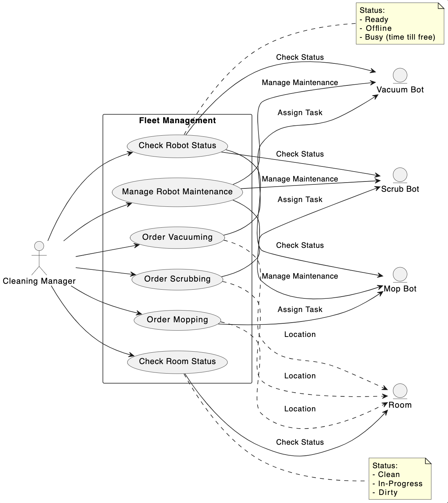

# Primary - Fleet Management Use Case

### Contributions:
* **Liz**
    - use_case.puml and .png
    - .md: Actors/Entities, Use Cases, Relationships
* **Waleed** 
    - .md: description, Cleaning Manager goal, Cleaning Manager actions 
* **Wonyoung**
    - reviewed and merged all pull requests 
* **Kate**
    - brainstorming

#

The Cleaning Managers will be able to manage their fleet of robots through a command line interface application. This UML diagram visualizes the interactions between a manager (`Cleaning Manager`), rooms, and various types of cleaning robots.

The **Cleaning Manager** will be able to:

* Check the status of the room
* Check the status of individual robots
    - Checks if robot's battery life and whether or not the specific robot is in need of maintenance
* Order the vacuum robot to vacuum selected room in building
* Order the mopping robot to mop selected room in building
* Order the scrubber robot to scrub selected room in building
* Facilitate the maintenance/charging station of the robots

## Actors/Entities:

1. **Cleaning Manager** The primary user who interacts with the fleet management tool to get statuses, manage maintenance, and assign tasks.
   
2. **Room**: Represents a physical room.
   
3. **Mop Bot**: A robot designed for mopping.
   
4. **Vacuum Bot**: A robot designed for vacuuming.
   
5. **Scrub Bot**: A robot designed for scrubbing.

## Use Cases:

1. **Check Robot Status**: Allows the Cleaning Manager to check the status of any robot:
    - **Ready**: The robot is available for tasks.
    - **Offline**: The robot is not operational.
    - **Busy**: The robot is currently working on a task, and the time until it's free is displayed.

2. **Check Room Status**: Allows the Cleaning Manager to check the cleanliness status of a room:
    - **Clean**: The room is already cleaned.
    - **In-Progress**: Cleaning is currently taking place in the room.
    - **Dirty**: The room is yet to be cleaned.

3. **Manage Robot Maintenance**: Enables the Cleaning Manager to send any robot to maintenance/charging station.

4. **Order Mopping**: The Cleaning Manager can assign mopping tasks to the Mop Bot.

5. **Order Vacuuming**: The Cleaning Manager can assign vacuuming tasks to the Vacuum Bot.

6. **Order Scrubbing (UC6)**: The Cleaning Manager can assign scrubbing tasks to the Scrub Bot.

## Relationships:

- Robot status interacts with Cleaning Manager and every robot type.
- Room cleanliness status interacts with rooms and Cleaning Manager.
- Maintenance management interacts with Cleaning Manager and each robot type.
- Mopping, vacuuming, and scrubbing use cases interact with Cleaning Manager, room, and their respective robots.

