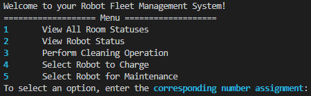

# This is your user guide's top level!

To access the our fleet management system, open your desired command terminal and navigate to our project which is called `course-project-krykna` and enter the following sequence of commands to create an executable for our app, as well as other features such as our test executables:

Once the build is completed, you should be able to navigate (change directory) to the app directory which should contain our app executable which is called `fleet_manager`:

After running these two commands, the terminal should now display this:

And this concludes our user guide for running the robot fleet management app. Have fun!